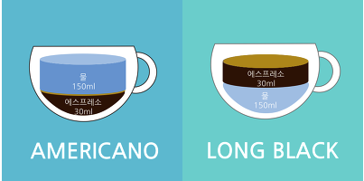
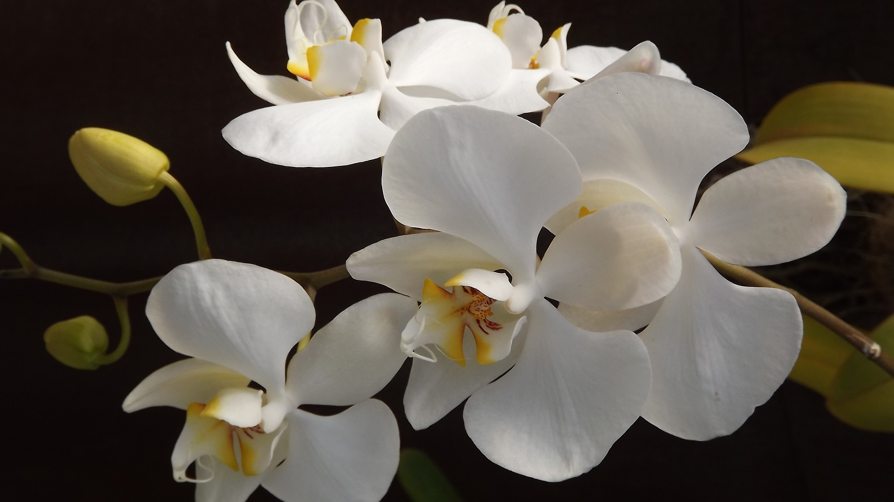
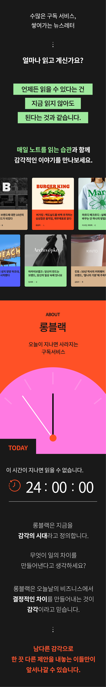

<style>
    
  @import url('https://fonts.googleapis.com/css2?family=Do+Hyeon&family=Dongle:wght@300;400;700&family=Montserrat:ital,wght@0,100;0,200;0,300;0,400;0,500;0,600;0,700;0,800;0,900;1,100;1,200;1,300;1,400;1,500;1,600;1,700;1,800;1,900&family=Noto+Serif+KR:wght@600&family=Poppins:ital,wght@1,600&display=swap');

   @import url('https://cdn.jsdelivr.net/gh/orioncactus/pretendard/dist/web/static/pretendard.css');
      * {
        font-family: 'Pretendard', serif;
      }
      @keyframes AnimationName {
        0% {
          background-position: 0% 50%;
        }
        50% {
          background-position: 100% 50%;
        }
        100% {
          background-position: 0% 50%;
        }
      }


section{
    font-family:'Noto Serif KR';
    background: linear-gradient(-45deg, #000, #343434, #282a36, #44475a );
        background-size: 300% 300%;
        animation: AnimationName 6s infinite;background: linear-gradient(-45deg, #000, #343434, #282a36, #44475a);
        background-size: 300% 300%;
        animation: AnimationName 6s infinite;
}
section{
    color:#fff;
}

h1{ color:#fff}

</style>

# DDC 2023

[Design Day] 23.01.29 [Tstory](https://100designer.tistory.com/6)

### 김리연 [롱블랙]

대담함과 섬세함, 롱블랙이<br> 경험을 설계하는 법

<style scoped>
h1 {
   font-family: 'Montserrat', sans-serif;
    padding-top: 0.5em;
    color:#f8f8f8;
    font-size:2.5em;
}

h3{ font-family:'Noto Serif KR';}
section{
    background:#101010;
    color:#fff;
}
span{
    font-size:0.8em;
}
</style>


---

<style scoped>
    h1{font-family:'Noto Serif KR';}
    section{ color:#00AA8B;}
</style>

# 프로덕트 메이킹 스토리

- 대담함

- 섬세함

- 그리고 콘텐츠

- 톺아보기


---

<style scoped>
    h1{font-family:'Noto Serif KR';}
    h1 {
    padding-bottom: 1em;
    color:#00AA8B;
}
</style>

# Long Black

> 생소한 이름 롱블랙, 커피에 관심을 가진 사람에게
> **어느 정도 귀에 익숙한 커피의 한 종류** > _익숙한 아메리카노와 차이는_
> 물과 에스프레소중 어느 것이 잔에 먼저 들어가냐...



---

<style scoped>
    h1{font-family:'Noto Serif KR';}
    h1 {
    padding-bottom: 0.5em;
    color:#00AA8B;
}
</style>

# 대담함 - Brave

### 남들과 다른 한 끗

- 시간의 강제성 [24H]

- 지금 읽지 않으면 읽을 수 없다.

- 밀도잇는 인사이트 컨텐츠 한개

- 쌓이지 않도록 습관을 도운다.


---

<style scoped>
    h1{font-family:'Noto Serif KR';}
    h1 {
    padding-bottom: 0.5em;
    color:#00AA8B;
}
</style>

# 섬세함 - Delicacy

### 3가지 요소

- 콘텐츠

- 연결

- 공간경험



---

<style scoped>
    h1{font-family:'Noto Serif KR';}
    h1 {
    padding-bottom: 0.5em;
    color:#00D063;
}
</style>

# 콘텐츠 - Contents

- 밀도있는 콘텐츠

- 서비스의 본질을 잃지 않는 것

- 포장은 본질이후, 고민하는 것



---

<style scoped>
    h1{font-family:'Noto Serif KR';}
    h1 {
    padding-bottom: 0.5em;
    color:#00D063;
}
</style>

# 연결 - Connect

- [online] 롱블랙 Slack 커뮤니티

- [online] 롱블랙 커피챗


---

<style scoped>
    h1{font-family:'Noto Serif KR';}
    h1 {
    padding-bottom: 0.5em;
     color:#00D063;
}
</style>

# 공간 경험 - Experience

- 검색하는 순간

- 마주하는 순간

- 머무는 순간


---

# Words from the Source

> There are darknesses in life and there are lights, and you are one of the lights, the light of all lights.
>
> -- Bram Stoker, Dracula

<style scoped>
h1 {
    padding-bottom: 1.5em;
}
</style>

---

# Screen portrayals

| Year | Title          | Actor             |
| ---- | -------------- | ----------------- |
| 1970 | Jonathan       | Paul Albert Krumm |
| 1995 | Monster Mash   | Anthony Crivello  |
| 2004 | Blade: Trinity | Dominic Purcell   |
| 2008 | Supernatural   | Todd Stashwick    |
| 2020 | Dracula        | Claes Bang        |

<style scoped>
table {
    margin-left: auto;
    margin-right: auto;
    color:#101010;
}
</style>

---

# 대담함 - Brave

- Small

- Fast

- Mammals

- Scientific name: Chiroptera


---

# Words from the Source

> There are darknesses in life and there are lights, and you are one of the lights, the light of all lights.
>
> -- Bram Stoker, Dracula

<style scoped>
h1 {
    padding-bottom: 1.5em;
}
</style>

---

# Bats - About

- Small

- Fast

- Mammals

- Scientific name: Chiroptera


---

# Bats - Implementation

```python
class Bat:
    def __init__(name:str, age:int):
        self.__name = name
        self.__age = age
    @property
    def name(self):
        return self.__name
    @property
    def age(self):
        return self.__age
    @property
    def speed(self):
        return 10 - self.age
```
