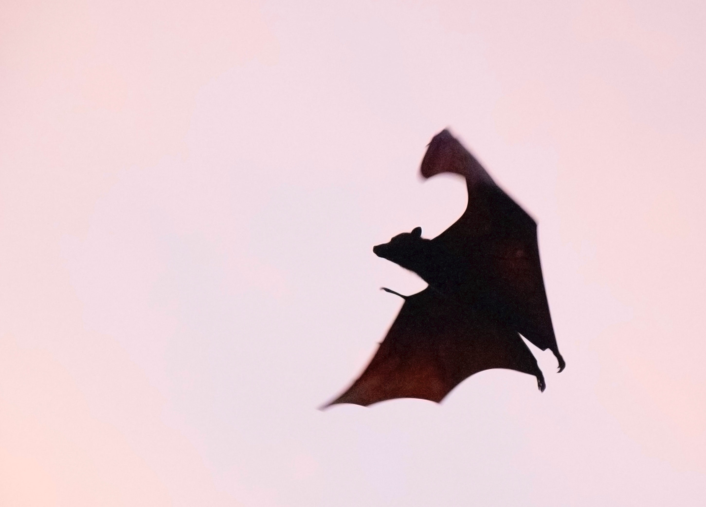

<style>
    
  @import url('https://fonts.googleapis.com/css2?family=Do+Hyeon&family=Dongle:wght@300;400;700&family=Montserrat:ital,wght@0,100;0,200;0,300;0,400;0,500;0,600;0,700;0,800;0,900;1,100;1,200;1,300;1,400;1,500;1,600;1,700;1,800;1,900&family=Noto+Serif+KR:wght@600&family=Poppins:ital,wght@1,600&display=swap');

section{
    font-family:'Noto Serif KR';
}


</style>

# DDC 2023

[Design Day] 23.01.29 [Tstory](https://100designer.tistory.com/6)
<br>
_김리연 [롱블랙]_
<span>
대담함과 섬세함, 롱블랙이<br> 경험을 설계하는 법
</span>

<style scoped>
h1 {
   font-family: 'Montserrat', sans-serif;
    padding-top: 0.5em;
    color:#f8f8f8;
}
section{
    background:#282a36;
    color:#fff;
}
span{
    font-size:0.8em;
}
</style>


---

# Bats - About

- Small

- Fast

- Mammals

* Scientific name: Chiroptera



---

# Screen portrayals

| Year | Title          | Actor             |
| ---- | -------------- | ----------------- |
| 1970 | Jonathan       | Paul Albert Krumm |
| 1995 | Monster Mash   | Anthony Crivello  |
| 2004 | Blade: Trinity | Dominic Purcell   |
| 2008 | Supernatural   | Todd Stashwick    |
| 2020 | Dracula        | Claes Bang        |

<style scoped>
table {
    margin-left: auto;
    margin-right: auto;
}
</style>

---

# Words from the Source

> There are darknesses in life and there are lights, and you are one of the lights, the light of all lights.
>
> -- Bram Stoker, Dracula

<style scoped>
h1 {
    padding-bottom: 1.5em;
}
</style>

---

# Bats - About

- Small

- Fast

- Mammals

- Scientific name: Chiroptera


---

# Bats - Implementation

```python
class Bat:
    def __init__(name:str, age:int):
        self.__name = name
        self.__age = age
    @property
    def name(self):
        return self.__name
    @property
    def age(self):
        return self.__age
    @property
    def speed(self):
        return 10 - self.age
```
